# Automate Creation of Join Savings Accounts using Solidity Smart Contracts

To implement smart contracts to automate institutions’ financial processes of hosting joint savings accounts.
And the features consists of the ability to deposit and withdraw funds from the account.
The smart contract will use ether management functions to implement this requirements.

### Here are the execution results in various sections of the project.

1) Created a Joint Savings Account Contract in Solidity.

2) Compiled and Deployed the Contract in the JavaScript VM without errors.

    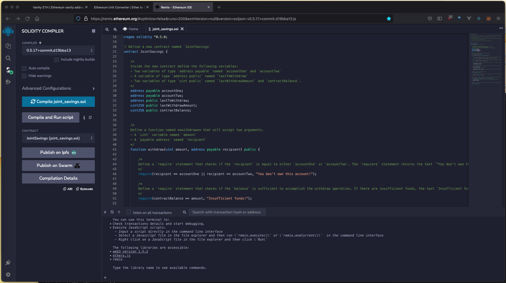

    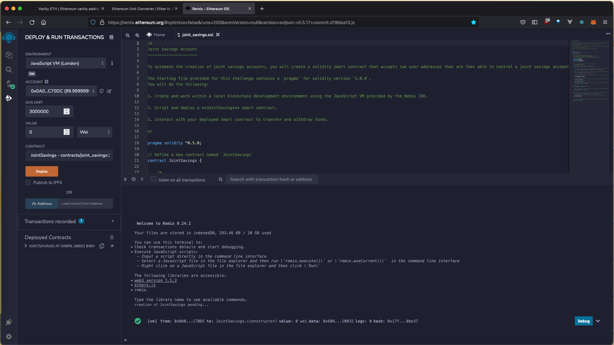

3) Exploring the Smart Contract functions

    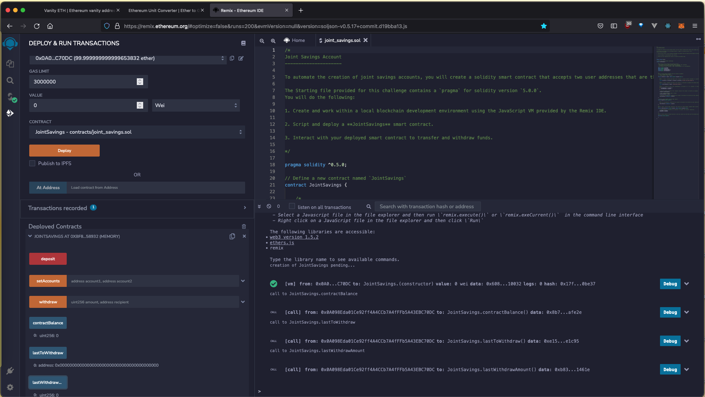

4) Interaction with Deployed Smart Contract are as below.

    **- Set Accounts.**

    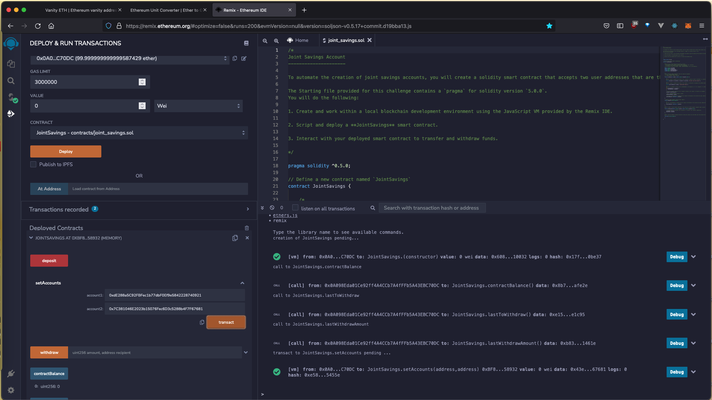

    **- Before Deposit of 1 ETH in Wei.**

    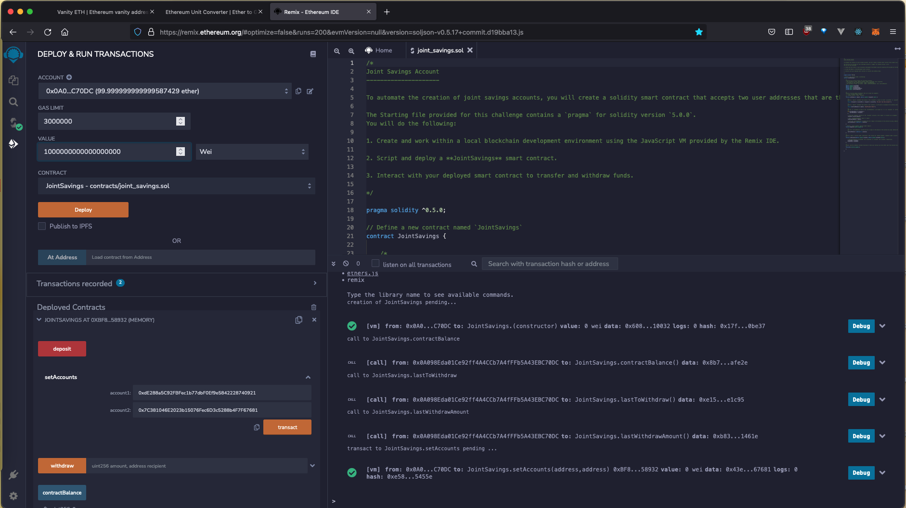

    **- After Deposit of 1 ETH in Wei.**

    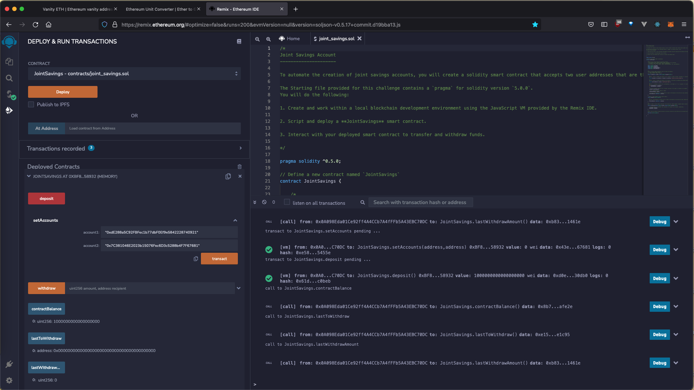

    **- After Deposit of 10 ETH in Wei.**

    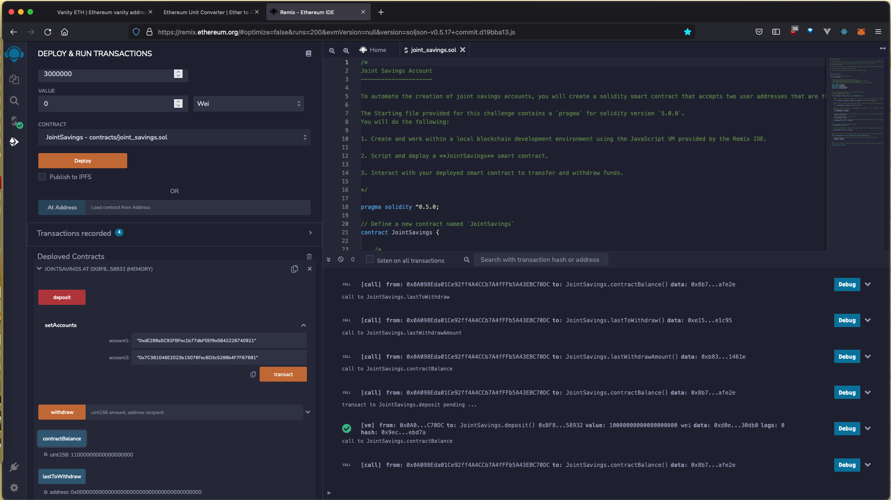

    **- Before Deposit of 5 Ether in ETH.**

    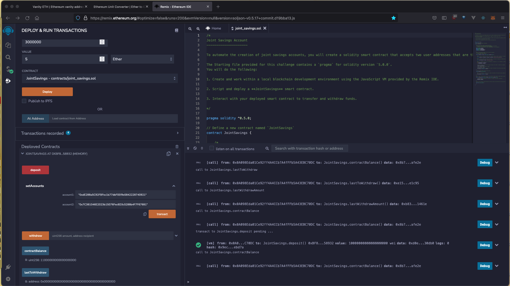

    **- After Deposit of 5 Ether in ETH.**

    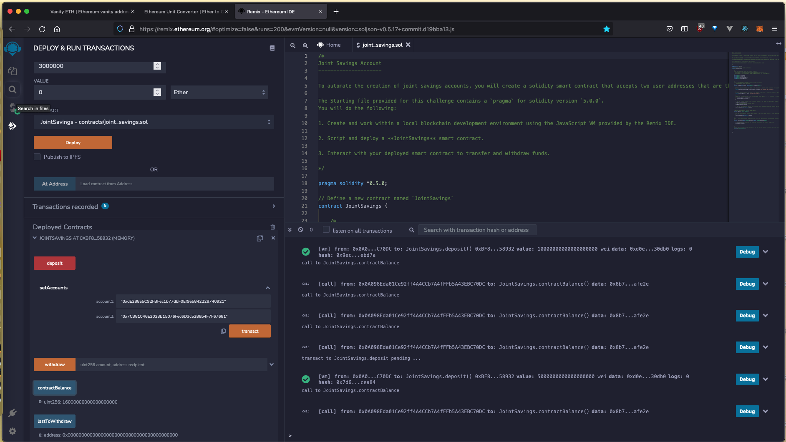   

    **- Before withdrawal of 5 Ether in Wei.**

    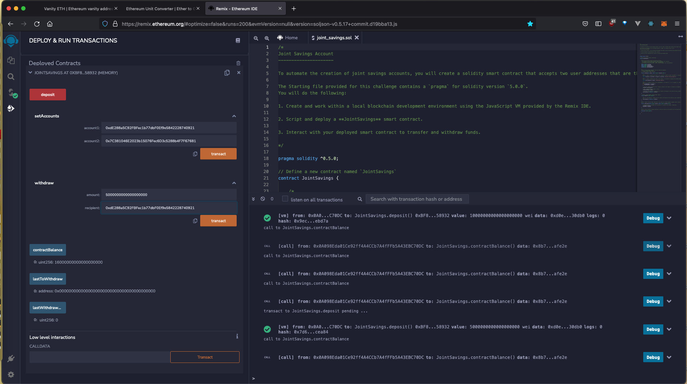

    **- After withdrawal of 5 Ether in Wei.**

    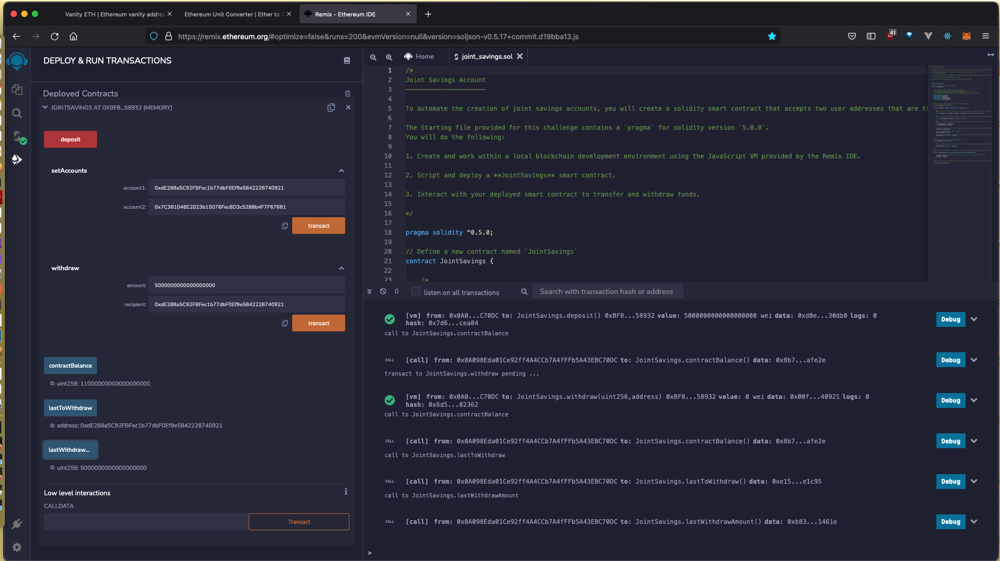   

    **- Before withdrawal of 10 Ether in Wei.**

    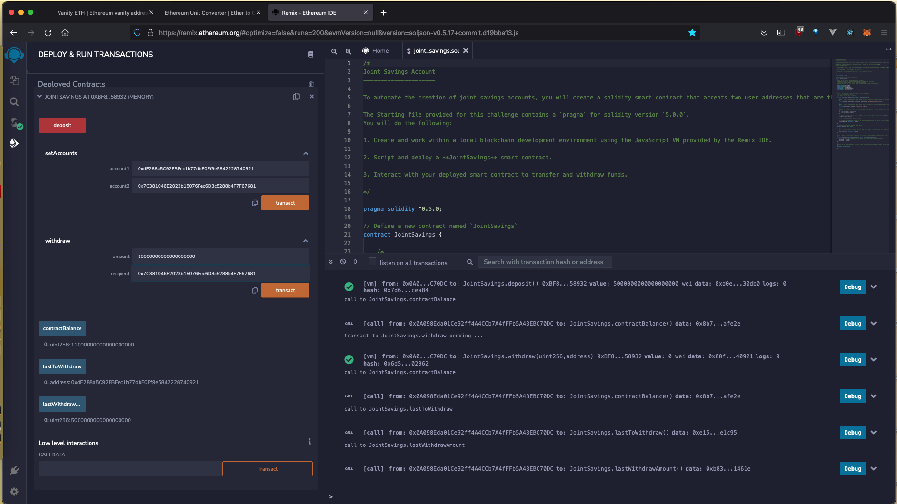

    **- After withdrawal of 10 Ether in Wei.**

    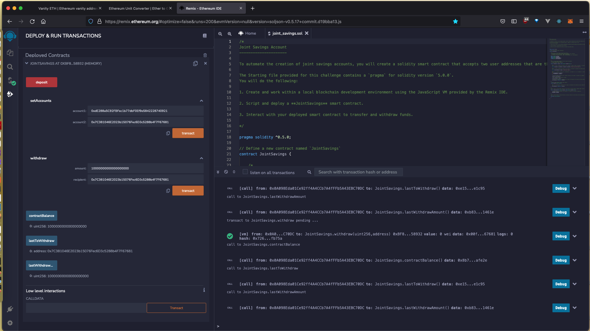 
    

After the above transactions the balance reflect the **1ETH** in the deployed contract.
